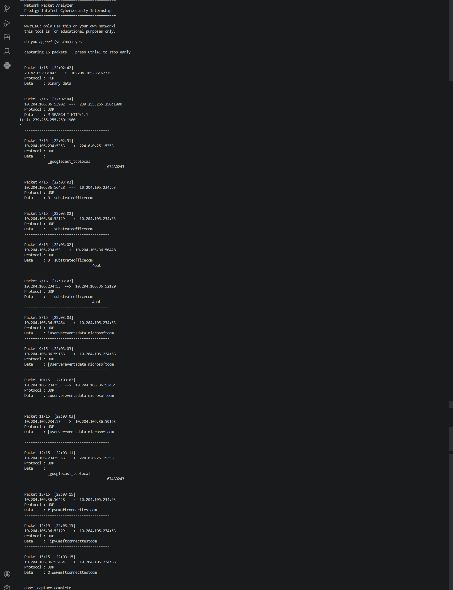

# PRODIGY_CS_05 — Network Packet Analyzer
> 🌐 Task 5 | Prodigy InfoTech Cybersecurity Internship

---

## 📌 About the Project

A packet analyzer (also called a network sniffer) is a tool that captures and inspects data packets traveling over a network. This project demonstrates how to capture live network traffic and extract basic information from each packet in a safe and ethical way.

Before capturing starts, the program displays a warning and asks for your agreement. No data is stored to a file or transmitted anywhere — everything is displayed in real time on your screen.

This project is built strictly for educational purposes as part of the Prodigy InfoTech Cybersecurity Internship.

---

## 🛠️ Features

* ✅ Displays ethical warning before capture begins
* ✅ Starts only after the user agrees (yes/no consent)
* ✅ Shows source and destination IP with port numbers
* ✅ Identifies protocols — TCP, UDP, ICMP
* ✅ Displays payload data (readable text or binary data)
* ✅ Live packet counter (Packet 1/15, 2/15...)
* ✅ Auto-stops after set number of packets
* ✅ Fallback mode if filter fails (common on Windows/Npcap setups)

---

## 🚀 How to Run

Make sure Python 3 is installed, then install the required library:

```bash
pip install scapy
```

> **Windows users** also need to install **Npcap**:
> 👉 https://npcap.com

**Windows** — open terminal as Administrator:
```bash
python packet_analyzer.py
```

**Linux / Mac:**
```bash
sudo python3 packet_analyzer.py
```

---

## 💻 Sample Output

```
  Packet 1/15  [14:23:05]
  192.168.1.5:51532  -->  142.250.183.78:443
  Protocol : TCP
  Data     : binary data
  ----------------------------------------

  Packet 2/15  [14:23:06]
  192.168.1.5:53201  -->  8.8.8.8:53
  Protocol : UDP
  Data     : DNS query
  ----------------------------------------
```

---

## 📸 Screenshot

### ▶️ Output


---

## 📁 File Structure

```
PRODIGY_CS_05/
│
├── packet_analyzer.py
├── README.md
└── output.png
```

---

## 🧠 How It Works

1. A warning is displayed and user must agree before anything starts
2. `scapy` starts sniffing network packets in the background
3. Each packet is passed to `analyze_packet()` automatically
4. Non-IP packets (like ARP) are skipped
5. Protocol is detected using `get_protocol()`
6. Port numbers are extracted using `get_ports()`
7. Payload data is read and decoded using `get_payload()`
8. Everything is printed in a clean format with a live counter
9. Stops automatically after `PACKET_COUNT` packets or on Ctrl+C

---

## 🔑 Key Concepts

| Concept | Purpose |
|---|---|
| `scapy` | Captures and reads live network packets |
| `sniff()` | Main function that starts packet capture |
| `haslayer()` | Checks which protocol layer a packet has |
| `get_protocol()` | Returns TCP / UDP / ICMP / Other |
| `get_ports()` | Extracts source and destination port numbers |
| `get_payload()` | Reads application data from inside the packet |
| `filter="ip"` | Captures only IP packets, ignores ARP etc. |
| `store=False` | Does not store packets in memory (saves RAM) |

---

## 📖 What I Learned

* How network packets are structured (IP layer, transport layer, payload)
* The difference between TCP, UDP, and ICMP protocols
* How port numbers identify services (port 80 = HTTP, port 443 = HTTPS, port 53 = DNS)
* How to use the `scapy` library to capture and read live traffic
* Why admin/root access is required for packet sniffing
* How payload data looks different for encrypted vs unencrypted traffic
* The difference between `packet[IP].payload` and `packet[TCP].payload`
* Why tools like Npcap are needed on Windows for raw packet access

---

## ⚠️ Limitations

* Requires admin/root access to run
* Windows requires Npcap to be installed separately
* Cannot decrypt encrypted traffic (like HTTPS/TLS)
* Only captures packets on the local machine's interface
* Payload may appear as binary data for encrypted traffic

---

## 🔒 Ethical Note

* Only use this on **your own network**
* Never capture packets **without permission**
* For **educational purposes only**
* No data is saved to a file or sent anywhere

---

## 👩‍💻 Author

**Anjali Kunwar Simari**
Cybersecurity Intern @ Prodigy InfoTech

---

## 🏷️ Tags

`#Cybersecurity` `#Python` `#PacketAnalyzer` `#NetworkSniffer` `#Scapy` `#ProdigyInfoTech`
